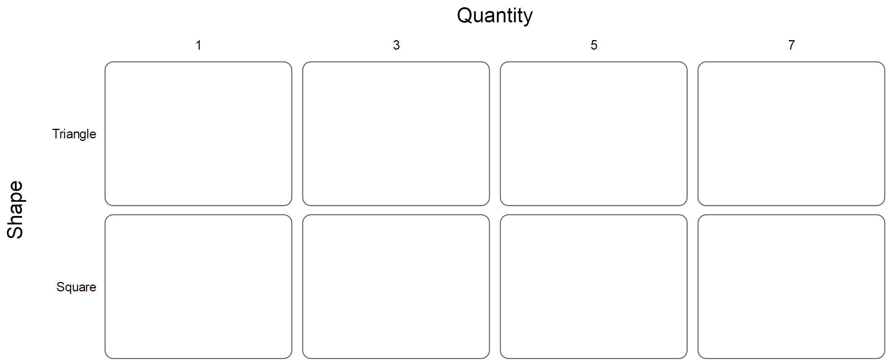
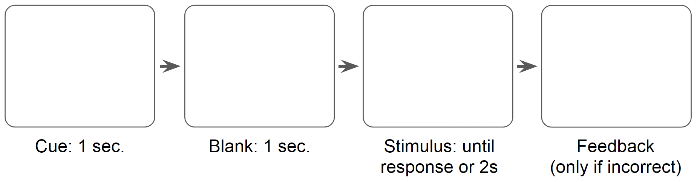

---
output:
  html_document:
    css: css/style.css
    theme: null
---
[(see readme)](http://steveharoz.com/public/experimentmethods/Readme.html)

# Experiment Methods Template - [Experiment Name]

## **Overall Experiment Procedure** 

> 1. Instructions
> 2. trials

> 1. Questionnaire
> 1. Instructions 
> 1. 2 sessions on consecutive days
>     1. 5 Practice trials
>     1. 2 Blocks of trials (Runs of 50 trials with a break in between runs)
> 1. Debrief questions

## **Subjects**  

* N = How many subjects were used in the analysis (excluding dropped subjects)?  
* How many subjects were dropped or excluded from the analysis and why?  
* Source, relevant demographics, and compensation of subjects

## **Independent Variables**  

* Variable Name A
    * Type: *Factor / Numerical / ...*
    * Values: *Red, Blue, Green / integers 1 - 10 / ...*
    * (for staircase) Describe the staircase parameters
    * Within subject / Between subject
        * (for within) Interleaved / Blocked
        * (for within) Anything to say about ordering?
        * (for between) How many subjects ran (but were not dropped) in each condition?
        * (for between) How many subjects were dropped from each condition?
* Variable Name B...
* Variable Name C...

(for within-subject multivariate experiments) Describe counterbalancing of combinations

## **Response Type**  

* Type: Forced choice / Yes-No / Method of Adjustment / Likert / Numerical input / ...
* Values: List the forced choice options, the numerical range, the Likert range and text, etc.
* Interface: How were subject responses entered? Keyboard / Slider / ...

> * 2 alternative forced-choice
> * Values: left, right
> * Responses were made via the left and right arrow keys. A mapping for the keys was shown on the screen.
        
> * 5 point Likert response
> * 1 strongly disagree, 2 somewhat disagree, 3 neutral, 4 somewhat agree, 5 strongly disagree
> * Responses were made via pencil on a pre-printed sheet of options.

## **Dependant Variables**

* Dependent Variable Name A (ex. *Accuracy*)
    * Values: *0 or 1*
    * Chance performance: *50%*
* Dependent Variable Name B (ex. Response Time)
    * Values: 0 - 2 seconds
    * Responses taking more than 2 seconds were counted as incorrect

## **(Optional) Questionnaire**

* If there was a questionnaire, include the entire questionnaire.

## **Instructions**  

* Explain what question was asked of subjects.  
* (suggested) Include a screenshot of instructions as they appeared to subjects.

> Question: "Is there a red item on the screen?"

## **Stimuli**  
Try to include an example or screenshot for every condition. In a multivariate experiment, show as many combinations as is reasonable. Multiple tables may be necessary.

> 

## **Trial Procedure**  
Be clear about every step, and include a screenshot. Feel free to branch if certain conditions have different procedures.

> 

## **Trial Count for Each Subject**

> 3 VariableA * 10 VariableB * 2 VariableC * 10 repetitions = 600 trials per subject 

> Each subject ran a staircase for every combination of variable A and B (3 * 2 = 6 staircases).  
> Staircases convergence took 41-63 trials.
