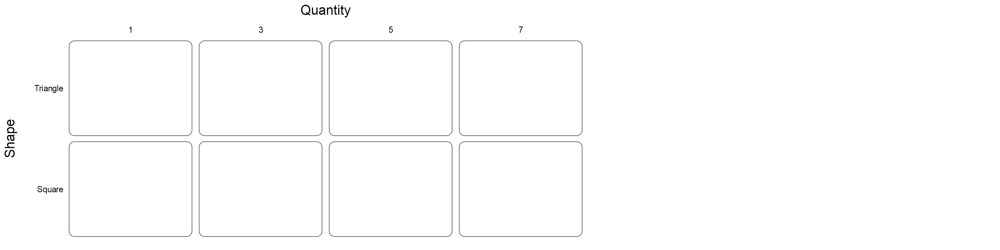
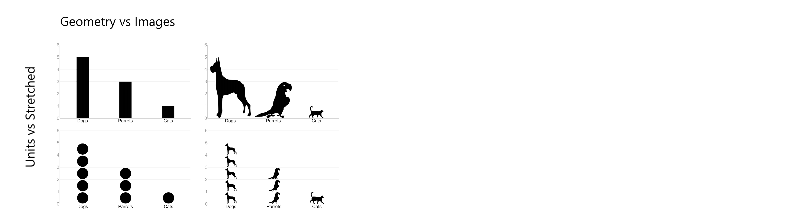

---
output:
  html_document:
    css: css/style.css
    theme: null
---
[Readme](./)

# Experiment Methods Template

Experiment methods should be described as clearly and precisely as possible to allow a reader to thoroughly and exactly replicate the experiment. This template describes a minimum set of information. Other information unique to an experiment but critical to its replication should also be included in the methods writeup.

## **Overall Experiment Procedure** 

List the sequence of experiment stages.

> 1. Instructions
> 2. trials

> 1. Questionnaire
> 1. Instructions 
> 1. 2 sessions on consecutive days. Each day included:
>     1. 5 Practice trials
>     1. 3 Blocks of trials (Runs of 50 trials with a break in between runs)
> 1. Debrief questions

## **Subjects**  

* N = How many subjects were used in the analysis (excluding dropped subjects)?  
* How many subjects were dropped or excluded from the analysis and why?  
* Source, relevant demographics, and compensation of subjects

## **Independent Variables**  

* Variable Name A
    * Type: *Factor / Numerical / ...*
    * Values: *Red, Blue, Green / integers 1 - 10 / ...*
    * (for staircase) Describe the staircase parameters
    * Within subject / Between subject
        * (for within) Interleaved / Blocked
        * (for within) Anything to say about ordering?
        * (for between) How many subjects ran (but were not dropped) in each condition?
        * (for between) How many subjects were dropped from each condition?
* Variable Name B...
* Variable Name C...

(for within-subject multivariate experiments) Describe counterbalancing of combinations

## **Trial Count for Each Subject**

Be explicit about how many trials each subject performed. For between-subject designs, explain the total number of trials.

> 3 VariableA * 10 VariableB * 2 VariableC * 10 repetitions = 600 trials per subject 

> Each subject ran a staircase for every combination of variable A and B (3 * 2 = 6 staircases).  
> Staircases convergence took 41-63 trials.

> Each subject ran 3 VariableA * 10 VariableB = 30 trials.  
> 28 subjects ran in condition C1. 29 subjects ran in condition C2.

## **Response Type**  

* Type: *Forced choice / Yes-No / Method of Adjustment / Likert / Numerical input / ...*
* Values: List the forced choice options, the numerical range, the Likert range and text, etc.
* Interface: How were subject responses entered? *Keyboard / Slider / ...*

> * 2 alternative forced-choice
> * Values: left, right
> * Responses were made via the left and right arrow keys. A mapping for the keys was shown on the screen.
        
> * 5 point Likert response
> * 1 strongly disagree, 2 somewhat disagree, 3 neutral, 4 somewhat agree, 5 strongly disagree
> * Responses were made via pencil on a pre-printed sheet of options.

## **Dependant Variables**

* Dependent Variable Name A (ex. *Accuracy*)
    * Values: *0 or 1*
    * Chance performance: *50%*
* Dependent Variable Name B (ex. Response Time)
    * Values: *0 - 2 seconds*
    * Responses taking more than 2 seconds were counted as incorrect

## **(Optional) Questionnaire**

* If there was a questionnaire, include the entire questionnaire.

## **Instructions**  

* Explain what question was asked of subjects.  
* (Suggested) Include a screenshot of instructions as they appeared to subjects.

> If you see a red item on the screen, press SPACE

## **Stimuli**  
Stimuli should be described as thoroughly as possible to allow for a precise replication. Describe any luminance differences or animation in a diagram and/or text. Include an example or screenshot for every condition. In a multivariate experiment, show as many combinations as is reasonable. Multiple figures may be necessary.

* Describe any imprecision in stimulus parameters (e.g., bar height was 30 +/- 2 pixels)
* (Claims involving color/luminance) Include color/luminance and calibration details
* (Claims involving size) Include pixel size, degrees of visual angle, and how it was measured

> 

> 
> Source: Haroz, Kosara, & Franconeri. 2015.

>   
> Source: Cicchini, Anobile, & Burr. 2016.

## **Trial Procedure**  
Be clear about every step, and include a screenshot. Feel free to branch if certain conditions have different procedures.

> 

> 
> Source: Haroz, Kosara, & Franconeri. 2015.

> 
> Source: Tsuchiya & Koch. 2005.

--------

 This work is licensed under a <a rel="license" href="http://creativecommons.org/licenses/by/4.0/">Creative Commons Attribution 4.0 International License</a>
.